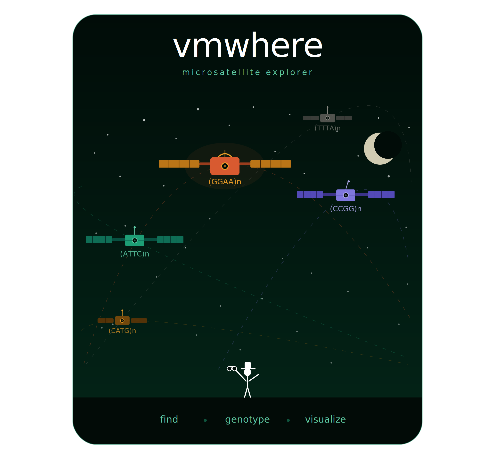

<div align="center">
  
</div>

# variant motif where? variant motif here!

VMwhere (VariantMotifwhere) is a tool for analyzing tandem repeat (microsatellite) regions from long-read sequencing data. It provides three core capabilities:

1. **Discovery** — identify microsatellite coordinates in a reference genome
2. **Genotyping** — call allele length, repeath length, and motif-level sequence decomposition at each locus
3. **Visualization** — generate sequence-resolved allele frequency plots

---

## Installation

VMwhere is available as a Python package:

```bash
pip install vmwhere
```

---
## Requirements

- **Python** >= 3.12.4

- **R** (>= 4.0) — required only for the `visualize` subcommand.
  Install required R packages:

  ```bash
  Rscript -e "install.packages(readLines('requirements-r.txt'), repos='https://cloud.r-project.org')"
  ```

---

## Usage

### 1. Find microsatellites

Scan a reference FASTA for tandem repeat regions matching a given motif.

```bash
vmwhere find \
  --motif GGAA \
  --perfect_repeats 4 \
  --max_gap 50 \
  --buffer_size 50 \
  --fasta data/reference.fasta \
  --output_dir output/
```

This outputs a BED file (`microsatellite_coordinates.bed`) with columns: `chr`, `start`, `end`, `region_id`, `motif`.

#### Parameters
| Flag | Description |
|------|-------------|
| `--motif` / `-m` | Repeat motif sequence to search for (e.g., `GGAA`) |
| `--fasta` / `-f` | Path to the reference genome FASTA |
| `--output_dir` / `-o` | Output directory |
| `--perfect_repeats` / `-r` | Minimum number of uninterrupted tandem repeats to call a microsatellite (default: 2) |
| `--max_gap` / `-g` | Maximum base pairs between adjacent microsatellites before they are treated as distinct loci (default: 50) |
| `--buffer_size` / `-b` | Base pairs to extend beyond the outermost repeat on each side (default: 50) |

See [`examples/run_vmwhere_find.sh`](examples/run_vmwhere_find.sh) for a runnable example.

### 2. Genotype microsatellites

Extract reads overlapping each locus, decompose sequences into motif and non-motif segments, cluster reads by Levenshtein distance, and call alleles.

```bash
vmwhere genotype \
  --sample_id example_sample \
  --bed_file data/T2T_regions.bed \
  --bam_file data/A673_sampled_reads.sorted.bam \
  --fasta data/GCF_009914755.1_T2T-CHM13v2.0_chr6_chr10.fasta \
  --cluster_distance 4 \
  --minor_threshold 0.20 \
  --major_threshold 0.80 \
  --output_dir output/ \
  --num_processes 2
```

See [`examples/run_vmwhere_genotype.sh`](examples/run_vmwhere_genotype.sh) for a runnable example.

#### Parameters

**Required:**

| Flag | Description |
|------|-------------|
| `--sample_id` | Sample identifier (used in output filename) |
| `--bam_file` | Path to sorted, indexed BAM file |
| `--fasta` | Path to the reference genome FASTA |
| `--bed_file` | Headerless BED file with columns: `chr`, `start`, `end`, `region_id`, `motif` |
| `--output_dir` | Output directory (file will be named `<sample_id>_vmwhere_results.tsv`) |

**Optional:**

| Flag | Description | Default |
|------|-------------|---------|
| `--cluster_distance` | Maximum Levenshtein distance for grouping reads into a cluster | 0 |
| `--minor_threshold` | Minimum read support fraction to call a minor allele | 0.20 |
| `--major_threshold` | Minimum read support fraction to call a homozygous genotype | 0.80 |
| `--num_processes` | Number of parallel processes | 24 |


#### Output TSV columns

The output follows VCF-style conventions but is written as a TSV for simpler parsing.

| Column | Description |
|--------|-------------|
| `CHROM` | Chromosome |
| `POS` | Start coordinate of the microsatellite |
| `ID` | Locus identifier from the input BED file |
| `REF` | Reference allele sequence |
| `ALT` | Alternate allele sequence(s); `.` if none |
| `END` | End coordinate of the microsatellite |
| `MOTIF` | Canonical repeat motif |
| `GT` | Genotype (e.g., `0/0` = homozygous reference, `0/1` = heterozygous) |
| `AL` | Allele length in base pairs |
| `CN` | Total copy number of the canonical motif (consecutive and interrupted occurrences) |
| `CNM` | Maximum uninterrupted copy number of the canonical motif (e.g., `6GGAA_1GGAT_2GGAA` = 6) |
| `MD` | Motif purity — fraction of allele base pairs matching the canonical motif |
| `DS_READ` | Decomposed sequence of the allele |
| `DS_REF` | Decomposed sequence of the reference |
| `RS` | Read support for the allele |


### 3. Visualize alleles at a microsatellite

Generate a PDF showing sequence-resolved allele structures and their frequencies at a given locus.

```bash
vmwhere visualize \
  --genotype_tsv output/example_sample_vmwhere_results.tsv \
  --microsatellite_id chr6_region_41 \
  --min_allele_count 0 \
  --output_pdf output/chr6_region_41_visualization.pdf
```

See [`examples/run_vmwhere_visualize.sh`](examples/run_vmwhere_visualize.sh) for a runnable example.


